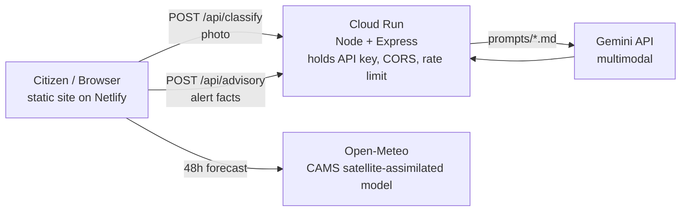

<div align="center">

# 🌍 AirWard Federation

**Turning every citizen into an air-quality sensor, and every alert into faster action.**

Hyper-local pollution detection and early warning across BRICS economic corridors, powered by citizen data, satellite-assisted forecasts, and Gemini.

`Track 2 · Clean Air & Climate Resilience` · `Build with AI: Code for Communities`

[Live demo](#) · [Pitch deck](#) · [Demo video](#)

</div>

---

## The problem

Major cities monitor air quality at a coarse, city-wide level. That misses the events that hurt people most: a crop fire two villages upwind, a factory plume over one neighbourhood, smog drifting across a border. Without real-time, granular data, authorities respond late and communities breathe the consequences.

## The solution

AirWard Federation combines three data sources and closes the loop from detection to action:

1. **Citizens** submit sensor readings and photos of what they see.
2. **Satellite-assisted forecasts** (Open-Meteo / CAMS) give the regional picture and a 48-hour outlook.
3. **Gemini** reads each photo, and writes plain-language advisories for residents and formal notes for authorities.

Where citizen readings disagree with the model, the platform flags a **hidden hotspot**, warns of forecast **spikes**, and produces a ready-to-send alert for the responsible agency. Nations improve each other's predictions by sharing a tiny **model-correction factor**, never raw citizen data.

## Features

| Feature | What it does |
|---|---|
| **Live corridor map** | 10 cities across 7 BRICS nations with real forecast data, animated by air quality |
| **Citizen reports** | PM2.5 sensor reading + photo + source type |
| **Gemini photo analysis** | Classifies the source (burning, industrial, dust, traffic), scores severity 1-5, cites visible evidence |
| **Hidden-hotspot detection** | Flags reports well above the model; two matching reports confirm a hotspot |
| **Forecast spike alerts** | Bias-corrected 48-hour forecast raises an alert before the peak |
| **Authority alerts** | Names the responsible agency; exports a CAP-style JSON message |
| **Gemini advisories** | One message for residents, one formal note for the authority |
| **Federated model sharing** | Nodes exchange only a correction factor and report count (federated averaging) |

## Architecture



- The **frontend** is plain HTML, CSS and JavaScript with no build step.
- The **backend** on Google Cloud Run keeps the Gemini key off the client and enforces CORS and a per-IP rate limit.
- **Prompts** live in `server/prompts/` as versioned files, so behaviour is reviewable and easy to tune.

## How detection works

1. A report is flagged if its PM2.5 is more than **1.5x** the model value and at least **25 µg/m³** higher.
2. Two flagged reports of the same source in one city give a **confirmed hotspot** (HIGH). One gives a **watch** item.
3. Each node learns a correction factor: the mean of `report / model`.
4. The shared factor is a report-weighted average across nodes (**federated averaging**). A node uses `(n·local + 2·shared) / (n + 2)` to correct its forecast.
5. A corrected forecast reaching AQI 151 or more, and at least 30 above the current value, raises a **forecast spike** alert.

## Project structure

```
airward/
├── index.html
├── styles.css
├── js/
│   ├── config.js    nodes, authorities, AQI bands, API_URL
│   ├── gemini.js    API client, image downscaling, HTML escaping
│   ├── data.js      Open-Meteo fetch with demo fallback
│   ├── model.js     federated correction, hotspot and spike detection
│   ├── ui.js        map, panels, alerts, animations
│   └── main.js      event wiring
├── server/          Cloud Run API
│   ├── server.js
│   ├── Dockerfile
│   └── prompts/     classify.md, advisory.md
└── tests/model.test.js
```

## Getting started

### 1. Run the frontend

Open `index.html` in a browser, or serve it:

```bash
python3 -m http.server   # then visit http://localhost:8000
```

Live forecasts need no key. Without an API URL the app still works and shows a clear message where Gemini features would appear.

### 2. Run the backend locally (for Gemini)

```bash
cd server
cp .env.example .env      # add your GEMINI_API_KEY from aistudio.google.com
npm install
npm run dev               # http://localhost:8080
```

Then set `API_URL = 'http://localhost:8080'` in `js/config.js`.

### 3. Deploy

**Backend on Google Cloud Run**

```bash
cd server
gcloud run deploy airward-api --source . --region asia-south1 --allow-unauthenticated \
  --set-env-vars GEMINI_API_KEY=YOUR_KEY,GEMINI_MODEL=gemini-3.6-flash,ALLOWED_ORIGINS=https://YOUR-SITE.netlify.app
```

For production, store the key in Secret Manager instead of a plain environment variable.

**Frontend on Netlify:** drag the project folder into Netlify (or connect the repo), after pasting the Cloud Run URL into `API_URL` in `js/config.js`.

### 4. Run the tests

```bash
node tests/model.test.js
```

Covers the AQI conversion, correction factors, hotspot rules, and the federated update.

## Configuration

| Variable | Where | Purpose |
|---|---|---|
| `GEMINI_API_KEY` | server | Gemini API key (never commit it) |
| `GEMINI_MODEL` | server | Model ID, default `gemini-3.6-flash` |
| `ALLOWED_ORIGINS` | server | Comma-separated frontend origins allowed by CORS |
| `API_URL` | `js/config.js` | Cloud Run service URL |

## Prototype limits and roadmap

This is a hackathon prototype. Being upfront about what is simulated:

- Reports are kept in memory only. **Next:** persist them in Firestore.
- Federation shares a scalar correction factor, not trained model weights, and updates are exchanged by copy and paste. **Next:** a shared registry service between nodes.
- Photo analysis relies on Gemini's judgement of a single image. **Next:** combine it with location, time and wind direction, and require corroboration before alerting.
- Sensor readings are entered manually. **Next:** direct ingestion from ESP32 PM2.5 sensors.

## Community impact

- **Residents** get timely, understandable guidance instead of a single city-wide number.
- **Authorities** get evidence-backed, location-specific alerts they can act on.
- **Countries** improve shared predictions without exposing citizen data, so cooperation does not depend on data-sharing agreements.

## Built with

Vanilla JavaScript · SVG · Google Cloud Run · Gemini API · Open-Meteo Air Quality API · Node.js / Express · Netlify

## License

MIT. Add a `LICENSE` file before publishing.
