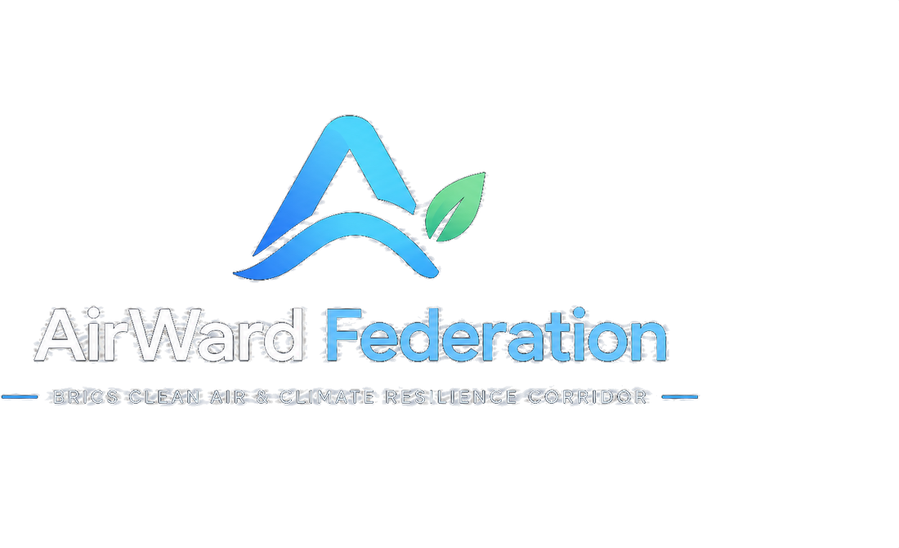
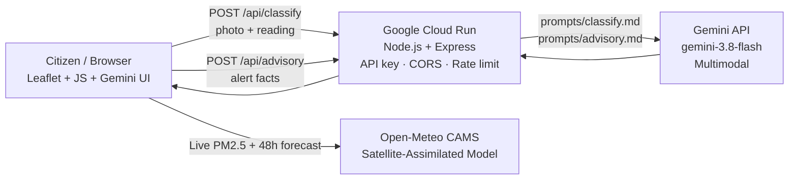

<div align="center">



**Turning every citizen into an air-quality sensor, and every alert into faster action.**

Hyper-local pollution detection and early warning across BRICS economic corridors — powered by citizen sensor data, CAMS satellite-assimilated forecasts, and Gemini multimodal AI.

`Track 2 · Clean Air & Climate Resilience` · `Build with AI: Code for Communities`

[](https://airward-federation-744515253917.europe-west1.run.app)
[]()
[](LICENSE)

</div>

---

## The problem

Governments monitor air quality at a coarse, city-wide scale. That misses the events that hurt people most: a crop fire two villages upwind, a factory plume drifting over one neighbourhood, or smog crossing a border. Without real-time granular data, authorities respond late and communities breathe the consequences.

## The solution

AirWard Federation combines three data sources and closes the loop from detection to action:

1. **Citizens** submit PM2.5 sensor readings and a photo of what they see.
2. **Satellite-assisted forecasts** (Open-Meteo / CAMS) provide the regional 48-hour picture.
3. **Gemini multimodal AI** analyses each photo, generates plain-language advisories for residents and formal directives for authorities.

Where citizen readings disagree with the satellite model, the platform flags a **hidden hotspot**, warns of forecast **spikes**, and produces a ready-to-send Common Alerting Protocol (CAP) alert for the responsible regulatory agency. Nations improve each other's predictions by sharing a tiny **model-correction scalar** — never raw citizen data.

---

## Live application

🌐 **[https://airward-federation-744515253917.europe-west1.run.app](https://airward-federation-744515253917.europe-west1.run.app)**

> Fully functional in **Local Demo Mode** without a Gemini API key. Connect a key to enable live AI photo analysis and advisory generation.

---

## Features

| Feature | What it does |
|---|---|
| **Real-world satellite map** | Interactive Leaflet.js map with Esri photographic Earth imagery + CartoDB dark radar mode. 10 BRICS sentinel cities with glowing AQI node pins, radar pulse animations, and dashed atmospheric corridor arcs. |
| **Live air quality data** | Real PM2.5 and AQI pulled from the Open-Meteo CAMS satellite-assimilated API for all 10 nodes; 15-minute client-side cache. Falls back to realistic diurnal synthetic baselines when offline. |
| **48-hour forecast chart** | Raw satellite model curve vs. federated-bias-corrected forecast with AQI threshold guide lines (50 / 100 / 151). |
| **Citizen sensor reports** | PM2.5 reading + pollution source type + optional photo. Gemini classifies the source, scores severity 1–5, and cites visible image evidence. |
| **Hidden-hotspot detection** | Flags a report when citizen PM2.5 > 1.5× model AND > 25 µg/m³ above it. Two matching-source reports confirm a hotspot (HIGH); one gives a WATCH. |
| **Forecast spike alerts** | Bias-corrected 48-hour forecast triggers an alert before a peak (corrected AQI ≥ 151 and ≥ 30 above current). |
| **Authority alerts & CAP JSON** | Names the responsible regulatory agency (CPCB, EEAA, MEE, etc.); exports a structured CAP v1.2 JSON alert ready for dispatch. |
| **Dual Gemini advisories** | One plain-language resident advisory, one formal authority enforcement directive — both generated by Gemini from alert facts. |
| **Federated model sharing** | Nodes exchange only a correction scalar and report count (federated averaging). Zero raw citizen data leaves the node. |
| **Dark / Light theme** | Full dark mode with glass-morphism UI; toggleable light mode. |

---

## Architecture



- The **frontend** is plain HTML + CSS + vanilla JS with no build step. A single `index.html` entry point.
- The **backend** runs on Google Cloud Run. It keeps the Gemini key off the client, enforces CORS, and applies a per-IP rate limit (60 req/min).
- **Prompts** live in `server/prompts/` as versioned Markdown files — fully reviewable and easy to tune without touching code.
- The entire stack ships in a **single Docker container** from the root `Dockerfile`.

---

## Sentinel nodes — 10 cities across 7 BRICS nations

| City | Country | Corridor | Regulatory Authority |
|---|---|---|---|
| 🇮🇳 New Delhi | India | Indo-Gangetic Agricultural & Industrial Belt | CPCB / DPCC |
| 🇮🇳 Mumbai | India | Konkan Industrial Maritime Corridor | MPCB |
| 🇨🇳 Beijing | China | Beijing-Tianjin-Hebei (Jingjinji) Clean Air Shield | MEE China |
| 🇨🇳 Shanghai | China | Yangtze River Delta Industrial Belt | SEEB |
| 🇧🇷 São Paulo | Brazil | Paulista Macrometropolis & Santos Port Corridor | CETESB |
| 🇿🇦 Johannesburg | South Africa | Highveld Priority Area Energy & Mining Corridor | DFFE |
| 🇷🇺 Moscow | Russia | Central Federal District Transportation Grid | Mosekomonitoring |
| 🇪🇬 Cairo | Egypt | Nile Valley & Greater Cairo Metropolitan Basin | EEAA |
| 🇦🇪 Dubai | UAE | Arabian Gulf Coastal Development Corridor | MoCCAE |
| 🇮🇷 Tehran | Iran | Alborz Mountain Basin Trapping Corridor | DOE Iran |

---

## How detection works

1. A citizen report is **flagged** if its PM2.5 is more than **1.5×** the satellite model value and at least **25 µg/m³** higher.
2. Two flagged reports of the same source type in one city → **CONFIRMED hotspot** (HIGH). One report → **WATCH** (MEDIUM).
3. Each node learns a **correction factor**: the mean ratio of `citizen_report / model_baseline`.
4. The **shared factor** is a report-weighted average across all nodes — federated averaging. A node uses `(n·local + 2·shared) / (n + 2)` to correct its forecast (Bayesian shrinkage toward the federation).
5. A corrected 48-hour forecast reaching AQI ≥ 151 and at least 30 points above the current value raises a **forecast spike alert**.
6. All alerts are exportable as structured **CAP v1.2 JSON**.

---

## Project structure

```
AirWard-Federation/
├── index.html                   # Single-page app entry point
├── styles.css                   # Complete responsive UI + Leaflet dark theme
├── Dockerfile                   # Full-stack container (frontend + backend)
├── cloudbuild.yaml              # Google Cloud Build CI/CD trigger config
├── deploy.sh                    # One-command Cloud Run deployment script (bash)
├── deploy.ps1                   # One-command Cloud Run deployment script (Windows)
├── firebase.json                # Firebase Hosting config (alternative deployment)
│
├── js/
│   ├── config.js                # 10 BRICS nodes, authorities, AQI bands, API_URL
│   ├── data.js                  # Open-Meteo CAMS fetch + diurnal fallback profiles
│   ├── model.js                 # EPA AQI conversion, hotspot detection, federated averaging, CAP generation
│   ├── gemini.js                # Gemini API client, image base64 downscaling, HTML escaping
│   ├── ui.js                    # Leaflet satellite map, forecast chart SVG, alert feed, modals, toasts
│   └── main.js                  # Event wiring, state management, citizen report flow
│
├── assets/
│   ├── logo.png
│   ├── logo-mark.png
│   └── favicon.png
│
├── server/
│   ├── server.js                # Express API: /api/classify, /api/advisory, /health
│   ├── Dockerfile               # API-only container (server/public/ included)
│   ├── package.json
│   ├── public/                  # Synced copy of frontend (served by Cloud Run)
│   └── prompts/
│       ├── classify.md          # Gemini system prompt: photo pollution classification
│       └── advisory.md          # Gemini system prompt: dual resident + authority advisory
│
└── tests/
    └── model.test.js            # Unit tests: AQI conversion, detection rules, federated averaging
```

---

## Getting started

### 1. Quick local run (full stack)

```bash
git clone https://github.com/Alcatraz234156/AirWard-Federation.git
cd AirWard-Federation

# Install server dependencies
cd server && npm install && cd ..

# Start the server (serves frontend + API on port 8080)
node server/server.js
```

Then open **http://localhost:8080** in your browser.

- **Without a Gemini key**: Works fully in Local Demo Mode — live air quality data, maps, hotspot detection, and alerts all function. Gemini AI features use high-fidelity synthetic fallbacks.
- **With a Gemini key**: Create `server/.env` with `GEMINI_API_KEY=your_key_here`, then restart the server to enable live photo analysis and AI advisories.

### 2. Run the tests

```bash
node tests/model.test.js
```

Covers EPA AQI conversion, correction factor calculation, hotspot confirmation rules, and federated averaging.

### 3. Deploy to Google Cloud Run

**Option A — one command (recommended):**

```bash
# In Google Cloud Shell or any machine with gcloud CLI
gcloud run deploy airward-federation \
  --source . \
  --region europe-west1 \
  --allow-unauthenticated \
  --set-env-vars GEMINI_API_KEY=YOUR_KEY,GEMINI_MODEL=gemini-3.8-flash,ALLOWED_ORIGINS=*
```

**Option B — deploy script:**

```bash
chmod +x deploy.sh && ./deploy.sh   # Linux / macOS / Cloud Shell
# or
.\deploy.ps1                         # Windows PowerShell
```

**Option C — Cloud Build trigger (CI/CD):**

Push to GitHub `main` and configure a Cloud Build trigger pointing to the `cloudbuild.yaml` in the repository root with **Dockerfile** type, directory `/`.

---

## Configuration

| Variable | Where | Purpose |
|---|---|---|
| `GEMINI_API_KEY` | `server/.env` or Cloud Run env | Gemini API key — never commit it. Get one at [aistudio.google.com](https://aistudio.google.com). |
| `GEMINI_MODEL` | `server/.env` or Cloud Run env | Model ID. Default: `gemini-3.8-flash`. Fallback: `gemini-2.5-flash`. |
| `ALLOWED_ORIGINS` | `server/.env` or Cloud Run env | Comma-separated frontend origins for CORS. Set `*` for open access. |
| `API_URL` | `js/config.js` or `localStorage` | Cloud Run service URL. Overridable at runtime via `localStorage.setItem('AIRWARD_API_URL', '...')`. |

---

## API endpoints

| Method | Endpoint | Description |
|---|---|---|
| `GET` | `/health` | Server health, model name, key status |
| `POST` | `/api/classify` | Gemini photo analysis — accepts `{ image, mimeType, city, reading, hintSource }` |
| `POST` | `/api/advisory` | Gemini dual advisory — accepts `{ city, country, source, pm25, aqi, authority, evidence, modelDifference }` |

Both endpoints include graceful fallback to high-fidelity synthetic responses when the Gemini key is absent or the API is temporarily unavailable.

---

## Prototype limits & roadmap

This is a hackathon prototype. Being upfront about what is simulated:

| Current state | Next step |
|---|---|
| Reports stored in browser memory only | Persist in **Firestore** with real-time listeners |
| Federation uses a scalar correction factor | Share trained gradient updates (**federated learning**) |
| Federation exchange is manual copy-paste | Automated peer-node registry service |
| PM2.5 readings are entered manually | Direct ingestion from **ESP32 / SDS011 IoT sensors** |
| Photo analysis uses one image | Correlate with location, wind direction, and time series for corroboration |

---

## Community impact

- **Residents** get timely, understandable guidance instead of a single coarse city-wide number.
- **Authorities** get evidence-backed, location-specific, actionable alerts with a named responsible agency.
- **Countries** improve shared predictions without exposing citizen data — cooperation that doesn't depend on data-sharing agreements.

---

## Built with

| Technology | Role |
|---|---|
| Vanilla JS + HTML + CSS | Frontend — no build step, no framework |
| [Leaflet.js](https://leafletjs.com/) + Esri World Imagery | Real-world photographic Earth satellite map |
| [Open-Meteo CAMS Air Quality API](https://open-meteo.com/) | Live PM2.5 + 48-hour satellite-assimilated forecasts |
| [Gemini API](https://aistudio.google.com/) (`gemini-3.8-flash`) | Multimodal photo classification + dual advisory generation |
| Node.js + Express | API proxy server (key protection, CORS, rate limiting) |
| Google Cloud Run | Serverless container hosting |
| Google Cloud Build | CI/CD via `cloudbuild.yaml` |
| Docker | Single full-stack container from root `Dockerfile` |

---

## License

MIT License — see [LICENSE](LICENSE) for details.

